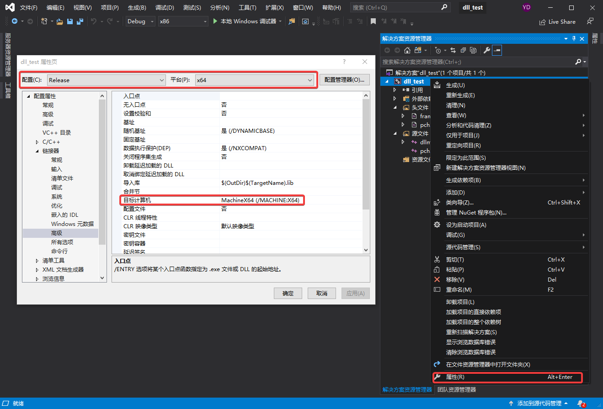

# Ctypes笔记(二) —— 操作流程

本文以对链表的一系列操作为例，介绍了使用`ctypes`在Python中调用C函数的详细流程。对于使用中涉及到的各种数据类型的转换，可参考[Ctypes笔记(一) —— 数据类型]( \.\/Ctypes笔记\(一\)\ ——\ 数据类型\.md )。

## 编写C源码
本例为链表相关的操作，首先声明链表的节点结构体`Node`，`Node`的成员变量有：`int`型变量`i`, `int`型数组变量`arr`, 结构体`Point`变量`point`, 指向`Node`的指针变量`next`. 其中，结构体`Point`的成员变量为`float`型变量`x`和`y`.

```C
typedef struct Point {
    float x;
    float y;
} Point;

typedef struct Node {
    int i;
    int arr[3];
    Point point;
    struct Node *next;
} Node;
```

以下为3个C函数的函数声明，`insert_node()`在链表末尾插入新节点，`delete_node()`在链表中删除目标节点，`print_list()`打印链表所有节点的内容。函数的具体实现见[test.cpp](../src/C/test.cpp).
```C
int insert_node(Node **linkp, int i, int arr[], Point point);
int delete_node(Node **linkp, int i);
void print_list(Node *head);
```
测试函数如下，向一个空链表中依次增加3个节点，再删除其中`i == 1`的节点。
```C
int main(void)
{
    Node *list=NULL;
    int arr[3] = {0, 1, 2};
    Point point = {3.0, 4.0};
    for (int i = 0; i < 3; i++)
        insert_node(&list, i, arr, point); 
    print_list(list);
    printf("deleting node 1...\n");
    delete_node(&list, 1);
    print_list(list);

    return 0;
}
```
测试程序运行结果如下：

```
--------------------------------------------
Node 0:
arr = [0, 1, 2],        point = (3.0, 4.0)
Node 1:
arr = [0, 1, 2],        point = (3.0, 4.0)
Node 2:
arr = [0, 1, 2],        point = (3.0, 4.0)
--------------------------------------------
deleting node 1...
--------------------------------------------
Node 0:
arr = [0, 1, 2],        point = (3.0, 4.0)
Node 2:
arr = [0, 1, 2],        point = (3.0, 4.0)
--------------------------------------------
```
## 编译生成动态链接库
动态链接库在Linux操作系统的后缀名为`.so`，在Windows操作系统的后缀名为`.dll`，在不同的操作系统中，生成动态链接库的方式也有所不同。此外，编译时还需注意，**调用动态链接库的Python位数应与库的位数匹配**，本例使用的开发环境均为64位版本。

### Linux
在Ubuntu 16.04系统中，使用gcc/g++命令将源码编译成动态链接库`libtest.so`。
> `gcc test.cpp -lm -fpic -shared -o libtest.so`

这里，对于C/C++的处理略有不同。  
我们使用`nm libtest.so`命令查看C代码编译产生的动态链接库文件`libtest.so`的导出函数表，在表中可以看到我们定义的三个函数名`delete_node, insert_node, print_list`
```
$ nm libtest.so
0000000000000a64 T delete_node
00000000000009a6 T insert_node
0000000000000ad9 T print_list
```

若将同样的源码作为C++来编译，`libtest.so`的函数导出表中与上述三个函数相关的内容如下。

```
$ nm libtest.so
0000000000000b20 T _Z10print_listP4Node
0000000000000a99 T _Z11delete_nodePP4Nodei
00000000000009d6 T _Z11insert_nodePP4NodeiPi5Point
```
这是由于C++增加了函数重载的功能，无法由函数名唯一确定对应的函数，编译器会在编译时根据函数的参数类型等信息对函数重命名。我们可以在希望调用的函数的声明前加上`extern "C"`，表示将以C的方式调用该函数。
```C
extern "C" int insert_node(Node **linkp, int i, int arr[], Point point);
extern "C" int delete_node(Node **linkp, int i);
extern "C" void print_list(Node *head);
```
修改上述声明后，重新将源码作为C++编译，相应的函数导出如下。
```
0000000000000a69 T delete_node
00000000000009a6 T insert_node
0000000000000af0 T print_list
```

### Windows
在Windows操作系统中，也可使用gcc/g++命令编译生成动态链接库，本文介绍一种在Visual Studio 2019中生成动态链接库的方法。
1. 在VS 2019中创建一个动态链接库新项目

新建好的DLL项目中有两个头文件和两个源文件。


2. 设置工程属性
打开项目属性页，修改项目配置、目标计算机等属性，以匹配Python位数。


3. 添加头文件、源文件  
向工程中添加编写好的头文件和源文件，并将需要预编译的标头添加至`pch.h`中。

4. 修改函数声明
使用VC编译，在导出函数的声明前还需加上`_declspec(dllexport)`。
```C
extern "C" _declspec(dllexport) int insert_node(Node **linkp, int i, int arr[3], Point point);
extern "C" _declspec(dllexport) int delete_node(Node **linkp, int i);
extern "C" _declspec(dllexport) void print_list(Node *head);
```

5. 编译
点击工具栏 -> 生成 -> 生成 *dll_test*(项目名)，输出栏显示生成成功，可在对应目录下找到生成的动态链接库`dll_test.dll`。


## 调用C函数
以Linux系统的操作为例，在Python中调用动态链接库中的C函数分为以下几步：

1. 载入动态链接库
```python
test_lib = ctypes.CDLL("./libtest.so")
```
2. 导入动态链接库中的函数  
```python
insert_node = test_lib.insert_node
delete_node = test_lib.delete_node
print_list = test_lib.print_list
```
3. 指定函数的参数类型与返回类型  
由于存在自定义的结构体等参数类型，需在Python建立好对应的ctypes类型映射。
```python
class Point(ctypes.Structure):
    _fields_ = [
        ("x", ctypes.c_float),
        ("y", ctypes.c_float)
    ]


class Node(ctypes.Structure):
    pass

Node._fields_ = [
    ("i", ctypes.c_int),
    ("arr", ctypes.c_int*3),
    ("point", Point),
    ("next", ctypes.POINTER(Node))
]
```
以`insert_node()`为例，该函数有4个输入参数，返回类型为`int`。
```python
insert_node.argtypes = [ctypes.POINTER(ctypes.POINTER(Node)), ctypes.c_int, ctypes.c_int*3, Point]
insert_node.restype = ctypes.c_int  # 返回类型默认为c_int，可省略
```
4. 调用函数。
```python
i = 0
arr = (ctypes.c_int*5)(0, 1, 2)
point = Point(3.0, 4.0)
linkp = ctypes.POINTER(Node)()
flag = insert_node(ctypes.byref(linkp), i, arr, point)
```
完整的Python测试代码见[test.py](../src/python/test.py)，测试程序运行结果如下，与C测试程序结果一致。
```
--------------------------------------------
Node 0:
arr = [0, 1, 2],	point = (3.0, 4.0)
Node 1:
arr = [0, 1, 2],	point = (3.0, 4.0)
Node 2:
arr = [0, 1, 2],	point = (3.0, 4.0)
--------------------------------------------
deleting node 1...
--------------------------------------------
Node 0:
arr = [0, 1, 2],	point = (3.0, 4.0)
Node 2:
arr = [0, 1, 2],	point = (3.0, 4.0)
--------------------------------------------
```


## 
## 参考资料

1. [extern "C"的用法解析](https://www.cnblogs.com/rollenholt/archive/2012/03/20/2409046.html)